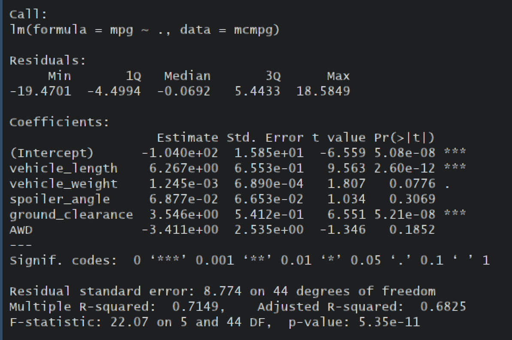
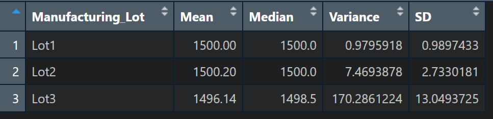
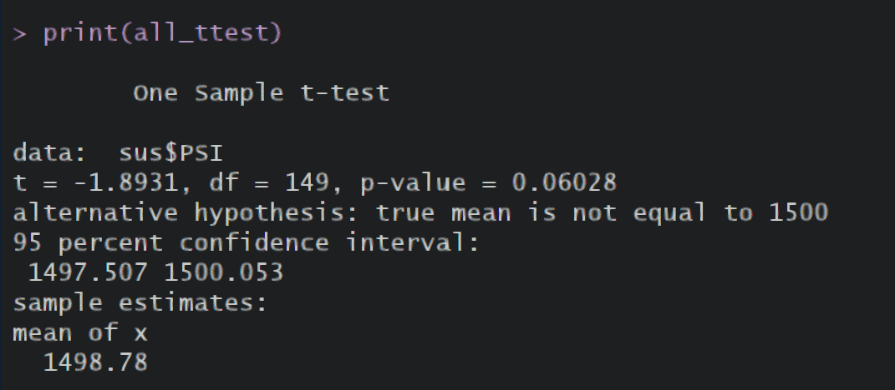
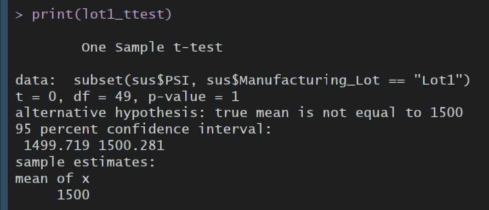
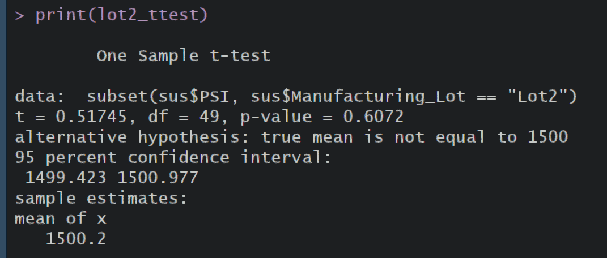
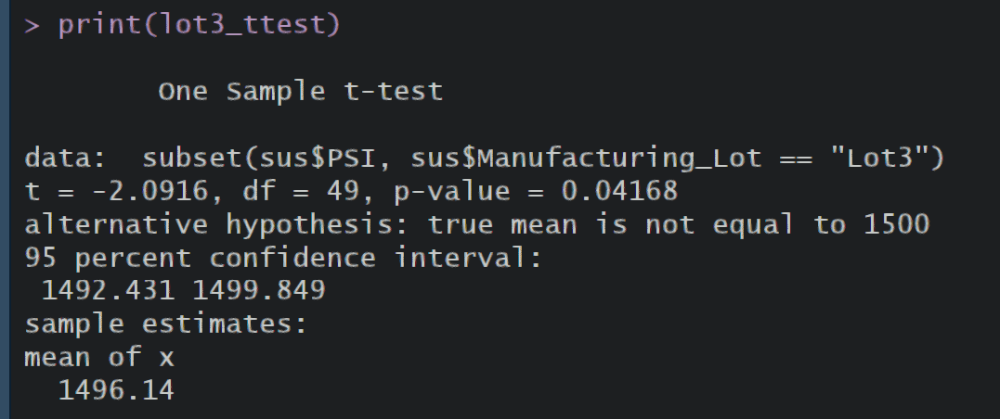

# MechaCar_Statistical_Analysis
 
## Linear Regression to Predict MPG

Vehicle length, weight, and ground clearance all appeared to have a hefty impact on mpg of the MechaCars since their coefficients' t-values were significantly higher (or lower) than 0.

The slope of our linear model would not be considered zero since we have found several statistically significant independent variables and the overall correlation between (some of) our variables and mpg is high.

This model has a multiple r-squared value of 0.7149 and adjusted r-squared value of 0.6825, so it does better than a random coin flip, but since the intercept has a high t-value and very small p-value, there are very likely other variables that are statistically significant.

## Summary Statsitics on Suspension Coils

Overall, Lot3 ruins the variance for the other two Lots, but if you look at the total variance, it meets the design specifications. The total variance for all three lots is just over 62 PSI. This is misleading, though, because Lot2 has variance under 10 PSI, and Lot1 has variance under 1 PSI. Since Lot3 has variance over 170PSI, not only does it not meet design specifications, such a vast difference indicates that something has gone wrong, whether that is a manufacturing error, measuring error, or an extreme outlier. It deserves further investigation.

## T-tests on Suspension Coils

These t-tests serve to reinforce that overall, the three lots (and the whole data set) mostly conform to design specifications, though the specs do have a very general downward trend which could indicate something in the manufacturing process degrading quickly, or another process-related issue. 
Lot1 is almost exactly spot-on the mean with very little deviation from the mean:

Lot2 has some more variance, but still remains very close to the mean:

Lot3 has more variance as well as a noticeably lower 95% confidence interval which doesn't even contain 1500 PSI (as the other two lots do):

## Study Design: MechaCar vs Competition

Since we already have some data on our miles per gallon, that would be one good metric to test against our competitors. It would probably be helpful to gather further data on city mpg vs highway mpg as that is a metric that is often available publicly for other vehicles.
We can use the city and highway mpg stats for similar competitors' vehicles to the MechaCar in t-tests similar to the ones we used on our suspension coils.
By gathering city mpg and highway mpg for each of our prototypes, we can compare our average efficiency to our competitors in a 2 sample t-test.
The null hypothesis would be that there is no statistical difference between our avg mpg and our competitor's avg mpg.
The alternative hypothesis would be that our avg mpg is higher than our competitors'.